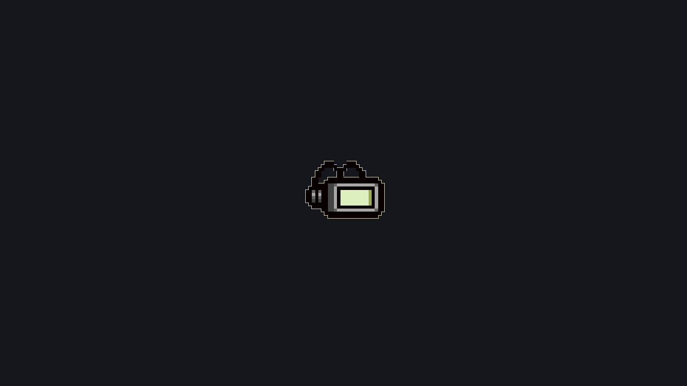
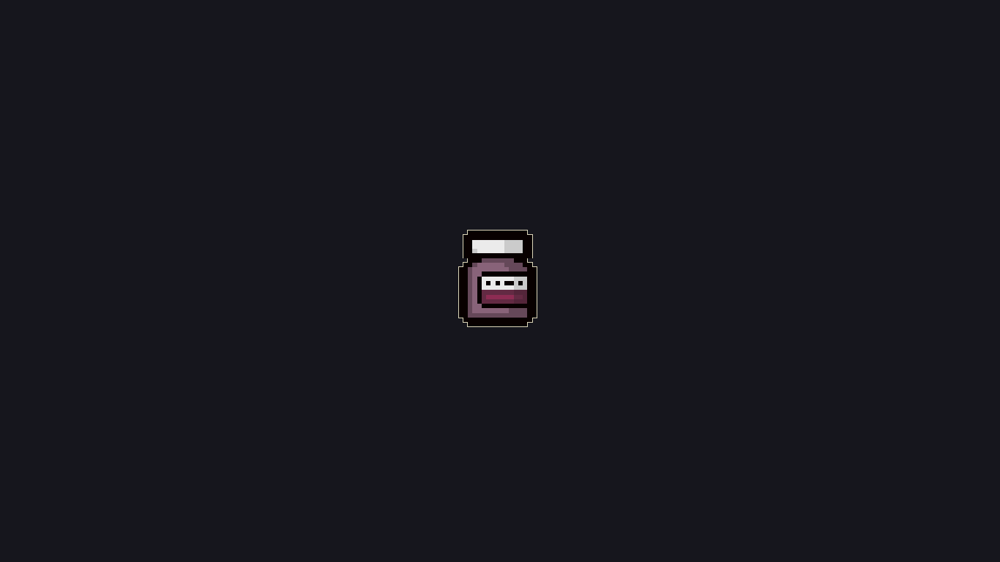
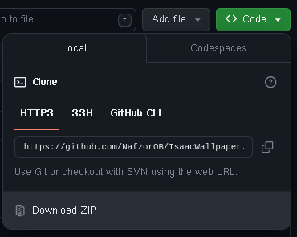
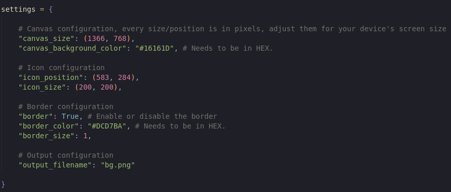

# Isaac Wallpaper

A Python script for creating randomly generated backgrounds with ***The Binding Of Isaac*** items/trinkets.

# Requirements

You will need [*Python 3*](https://www.python.org/downloads/) and the [*Pillow*](https://pypi.org/project/Pillow/) library for Python installed on your computer.

# Installation

You can clone this repository with the following command:

    git clone https://github.com/NafzorOB/IsaacWallpaper

...or by downloading and extracting the compressed file at the top of the page:

# Using

Open your terminal, go to the cloned/downloaded directory and run:

    python3 generate.py

This will generate a file called **bg.png** on the directory with your generated background. By default, running the command will generate a background using a random icon, but if you want to generate an image using an icon of your preference you can run:

    python3 generate.py "Brimstone.png"

You can replace *Brimstone.png* with the item/trinket that you want. See the [assets/](https://github.com/NafzorOB/IsaacWallpaper/tree/main/assets/) folder for a list of all of them.

# Configuring

You can configure the position, size, border and more on the **generate.py** file. Open it and you will see something like this:

You can modify the values on the file however you want. The size dimensions are expressed in pixels, and the colors on HEX format.

Also if you want to exclude an item or trinket, delete it from the [assets/](https://github.com/NafzorOB/IsaacWallpaper/tree/main/assets/) folder.

# Credits

All the icons were scrapped from [The Binding of Isaac: Rebirth Wiki](https://bindingofisaacrebirth.fandom.com/wiki/Binding_of_Isaac:_Rebirth_Wiki).

The Binding of Isaac: Rebirth content and materials are the intellectual property of their respective owners.
This project is NOT associated with Edmund McMillen or Nicalis.